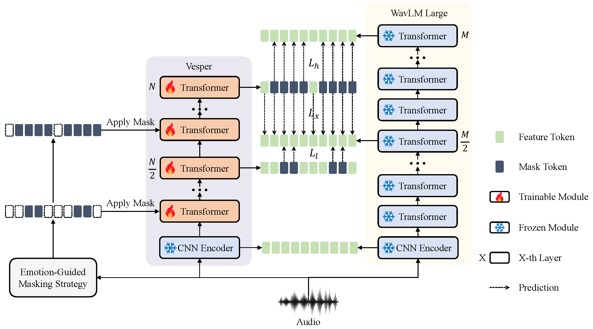

# Vesper

[\[Paper\]](https://arxiv.org/abs/2307.10757) Vesper: A Compact and Effective Pretrained Model for Speech Emotion Recognition

## Data Preparation
Modify the variables of each dataset in the ```configs/dataset_config.py```.  
1. Move your audio files to the ```wavdir``` directory.
2. Create a meta_csv_file with columns ```name``` (file names) and ```label``` (emotional labels) for each dataset. The pretraining datasets do not need the ```label``` column.

Extracting WavLM features in advance can accelerate the pretraining speed greatly. Please use the ```extract_feature/WavLM/extract_wavlm.py``` file to extract the features of pretraining data in advance.

## Pretraining
Specify training hyperparameters on the command line or modify them in the ```configs/train_config.py```.  
Please also specify ```path_to_wavlm``` on the command line or in the ```configs/model_config.py```.  
Please refer to the ```get_args``` function in the ```configs/__init__.py``` if you want to use the command line method.
```python
python pretrain.py -M Vesper-4
python pretrain.py -M Vesper-12
python pretrain.py -M Vesper-12 -b 32 -g 0,1 -l 0.0005 --model_path_to_wavlm PATH_to_WavLM/WavLM-Large.pt
```

## Fine-tuning
Specify fine-tuning hyperparameters on the command line or modify them in the ```configs/train_config.py```.  
Please also specify ```path_to_vesper``` on the command line or in the ```configs/model_config.py```.
```python
python finetune.py -M Vesper-12 -d iemocap
python finetune.py -M Vesper-12 -d iemocap -g 0 -b 32 -l 0.0007 --model_path_to_vesper PATH_to_EXP_DIRECTORY/checkpoint/model_best.pt
```
